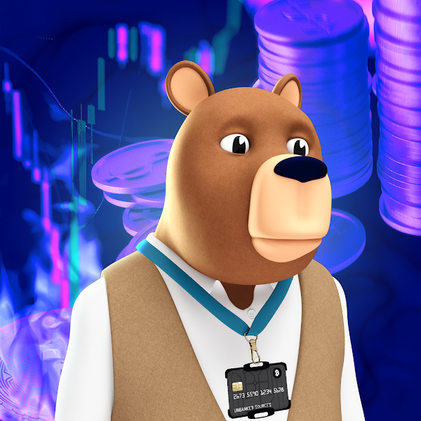

# Welcome to Jorge's GitHub Page

---

---

### What would you do diffrently today?
### We are in the age of nearly infinite leverage

---

# **About Me**

My family migrated to united states from El Salvador back in the 80's escaping a civalwar, I am a first generation Salvadorian-American, and I never took advantage of schooling when I was younger so now I’m trying my best to push myself past my boundaries and comfort zone. I know there is a lot of knowledge out there and I want to learn as much as I can in my lifetime and hopefully apply those skills for something greater than myself.

I came across TheClubhou.se accidently from my brother in law who moved down here with my from NY with his family and have then decided that since I was coming down for a fresh start that this program wis aligned which my current interest in life as far as a career in being a developer. The Clubhou.se seemed like the perfect investment in myself to learn how to program to implement these skills to build a standard web application from the front-end design to back-end data management to start my journey as a Web Developer.

As I go thru the journey of of becoming a Web Devolper I plan on using those skill to help contribute to a DAO Project I am currently invovled in that is on the Stellar Blockchain called THE JPEG DAO where the members collaborate to provide the commnuity with amazing NFT experiences!

---

>  The greatest superpower is the ability to change yourself. Naval Ravikant

---

This is one of my favorite quotes that I try to live by everyday

### These are some of the things I like to do on a daily basis and would like to share with you today

* Learning new things
* Gaming
* Helping others
***

### Some fun facts about me

- I know how to cook
- But I dont know how to dance
- I can beat anyone in FIFA
- And I someday would like to get a bunch of tattos 

---

My twitter account is [@3Fig69](https://twitter.com/3Fig69) and I try to regularly post and share things that are Crypto/blockchain related 

To know more about a DAO project im currently invovled in where we share ideas, find support, and learn new skills from talented indivduals from all over the world. To know more about this project check out [TheJPEGDAO.com](https://www.thejpegdao.com) where a JPEG is not just an NFT